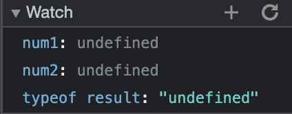

# DevTools - Debugging

## Screenshot of the list of breakpoints containing the breakpoint.

 

## Screenshot of the watch expressions list.

  

## 1. What was the bug?
> - The variables `num1` and `num2` passed to function `calculateSum` are of type string. 
> - The statement `let result = num1 + num2` do the concatenation of two strings.

## 2. How would you fix it? Include a screenshot of your fix. Name it fix.png (or whatever image extension you would like to use)
> - We need to convert the type of `num1` and `num2` from string to number.
> - Thus, I use `Number()` to convert them.
> 
> 
